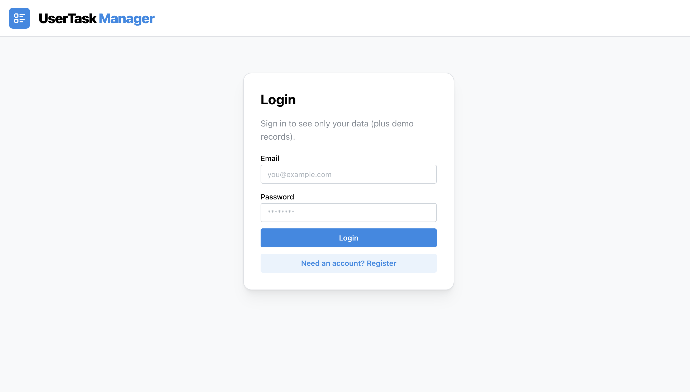
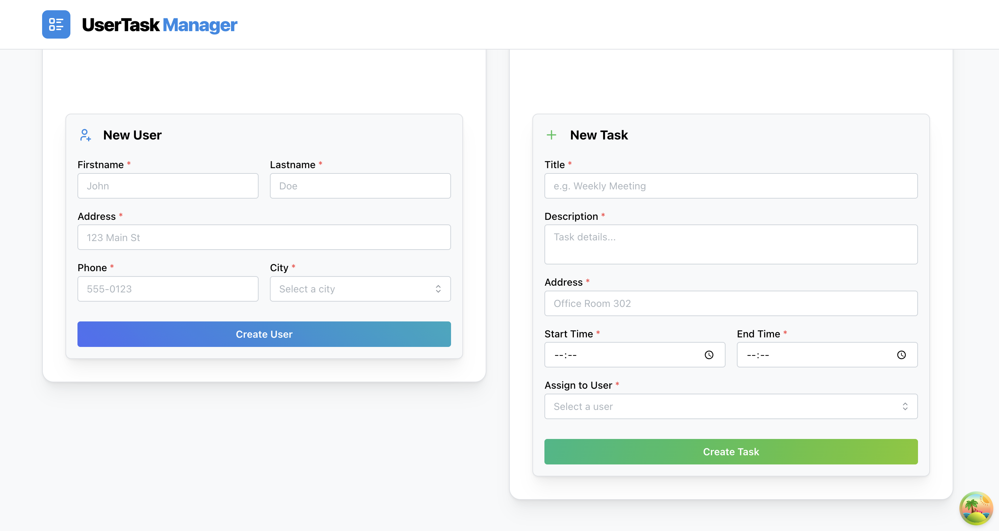

# UserTask Manager

[](https://www.typescriptlang.org/)
[](https://reactjs.org/)
[](https://nodejs.org/)
[](https://www.postgresql.org/)
[](https://www.docker.com/)

A modern fullstack CRUD application for managing Users and Tasks with multi-tenant architecture, built with TypeScript, React, and PostgreSQL.

## 🚀 Live Demo

Try it instantly in your browser (no installation required):

[](https://gitpod.io/#https://github.com/Alexandr-Paleev/UserTask-fullstack)

## 📸 Screenshots

<div align="center">
  
  
</div>

## ✨ Key Features

### Architecture & Security

- 🔐 **JWT Authentication** with secure token handling
- 👥 **Multi-tenant Architecture** - complete data isolation per account
- 🛡️ **Rate Limiting** on auth endpoints (20 attempts per 15 minutes)
- 🔒 **Password Hashing** with bcrypt
- 🌐 **CORS Configuration** with environment-based origins

### Frontend

- ⚡ **Modern React** with Hooks and TypeScript
- 📊 **TanStack Query** for efficient server state management
- 🎨 **Mantine UI** - beautiful, accessible components
- ✅ **React Hook Form + Zod** - type-safe form validation
- 🎯 **Smart Caching** - queries only run after authentication

### Backend

- 🏗️ **Clean Architecture** with separation of concerns
- 🗃️ **TypeORM** with PostgreSQL
- 🔄 **Automatic City Seeding** on first login
- 📝 **Comprehensive Validation** on backend and frontend
- 🩺 **Health Check** endpoint for monitoring (`/health`)

### DevOps

- 🐳 **Docker Compose** - one-command setup
- 📦 **Hot Reload** in development (both client and server)
- 🔧 **Environment Variables** with templates
- 📋 **ESLint + Prettier** - consistent code style

## 🛠️ Tech Stack

### Backend

- **Node.js** & **Express** - REST API server
- **TypeScript** - type safety
- **PostgreSQL** - relational database
- **TypeORM** - ORM with migrations
- **JWT** - authentication
- **bcryptjs** - password hashing
- **express-rate-limit** - DDoS protection

### Frontend

- **React 18** - UI library
- **TypeScript** - type safety
- **Vite** - fast build tool
- **Mantine** - component library
- **TanStack Query** - server state management
- **React Hook Form** - form handling
- **Zod** - schema validation
- **Axios** - HTTP client

### DevOps

- **Docker** & **Docker Compose**
- **PostgreSQL 14** (Alpine)

## 🚀 Quick Start

### Option 1: Docker Compose (Recommended)

The easiest way to run the entire stack:

```bash
cd UserTask
export JWT_SECRET="change_me_locally_please"
docker compose up --build
```

Then seed the database:

```bash
docker exec -it usertask-server npm run seed
```

Open in browser: **http://localhost:3000**

### Option 2: One-Command Local Dev

From repository root:

```bash
npm install
npm run dev
```

### Option 3: Manual Setup

<details>
<summary>Click to expand manual setup instructions</summary>

#### Server

```bash
cd UserTask/server
cp .env.example .env
# Edit .env with your values
npm install
npm run dev
```

#### Client

```bash
cd UserTask/client
cp .env.example .env
# Edit .env with your values
npm install
npm run dev
```

#### Database

Make sure PostgreSQL is running locally or update connection in `.env`.

</details>

## 📚 API Documentation

### Authentication

```bash
# Register
POST /auth/register
Content-Type: application/json
{ "email": "user@example.com", "password": "12345678" }

# Login
POST /auth/login
Content-Type: application/json
{ "email": "user@example.com", "password": "12345678" }

# Get current user
GET /auth/me
Authorization: Bearer <token>
```

### Users

```bash
# Get all users (own + demo)
GET /user
Authorization: Bearer <token>

# Create user
POST /user
Authorization: Bearer <token>
Content-Type: application/json
{
  "firstname": "John",
  "lastname": "Doe",
  "address": "123 Main St",
  "phone": "555-0123",
  "city": { "title": "London" }
}

# Delete user
DELETE /user/:id
Authorization: Bearer <token>
```

### Tasks

```bash
# Get all tasks (own + demo)
GET /task
Authorization: Bearer <token>

# Create task
POST /task
Authorization: Bearer <token>
Content-Type: application/json
{
  "title": "Meeting",
  "description": "Weekly sync",
  "address": "Office",
  "startTime": "09:00",
  "endTime": "10:00",
  "user": { "id": 1 }
}

# Delete task
DELETE /task/:id
Authorization: Bearer <token>
```

### Health Check

```bash
GET /health
# Returns: { "status": "ok", "timestamp": "2024-01-01T00:00:00.000Z" }
```

## 🧪 Testing

```bash
# Lint
npm run lint

# Type check (client)
cd UserTask/client && npm run typecheck

# Type check (server)
cd UserTask/server && npx tsc --noEmit
```

## 📁 Project Structure

```
UserTask-fullstack/
├── UserTask/
│   ├── client/                # React frontend
│   │   ├── src/
│   │   │   ├── api/          # API client and queries
│   │   │   ├── components/   # React components
│   │   │   ├── queries/      # TanStack Query hooks
│   │   │   ├── types/        # TypeScript types
│   │   │   └── utils/        # Helper functions
│   │   ├── .env.example
│   │   └── vite.config.ts
│   │
│   ├── server/               # Express backend
│   │   ├── src/
│   │   │   ├── controllers/  # Request handlers
│   │   │   ├── models/       # TypeORM entities
│   │   │   ├── routes/       # API routes
│   │   │   ├── services/     # Business logic
│   │   │   ├── middlewares/  # Auth, rate limiting
│   │   │   └── server.ts     # Entry point
│   │   ├── .env.example
│   │   └── tsconfig.json
│   │
│   ├── docker-compose.yml    # Docker orchestration
│   └── env.example           # Environment template
│
├── package.json              # Root scripts
├── eslint.config.mjs         # ESLint config
└── README.md
```

## 🔧 Environment Variables

### Server (`UserTask/server/.env`)

```bash
# Database
POSTGRES_HOST=localhost
POSTGRES_PORT=5432
POSTGRES_USER=postgres
POSTGRES_PASSWORD=postgres
POSTGRES_DB=usertask

# Server
PORT=5001

# Security (REQUIRED)
JWT_SECRET=change_me_to_a_strong_random_string_in_production
CORS_ORIGIN=http://localhost:3000
```

### Client (`UserTask/client/.env`)

```bash
VITE_API_URL=http://localhost:5001
```

## 🤝 Contributing

Contributions are welcome! Please feel free to submit a Pull Request.

## 📝 License

This project is open source and available under the [MIT License](LICENSE).

## 👤 Author

**Aleksandr Paleev**

- GitHub: [@Alexandr-Paleev](https://github.com/Alexandr-Paleev)
- Email: paleev045@gmail.com

---

<div align="center">
  Made with ❤️ using TypeScript, React, and PostgreSQL
</div>
